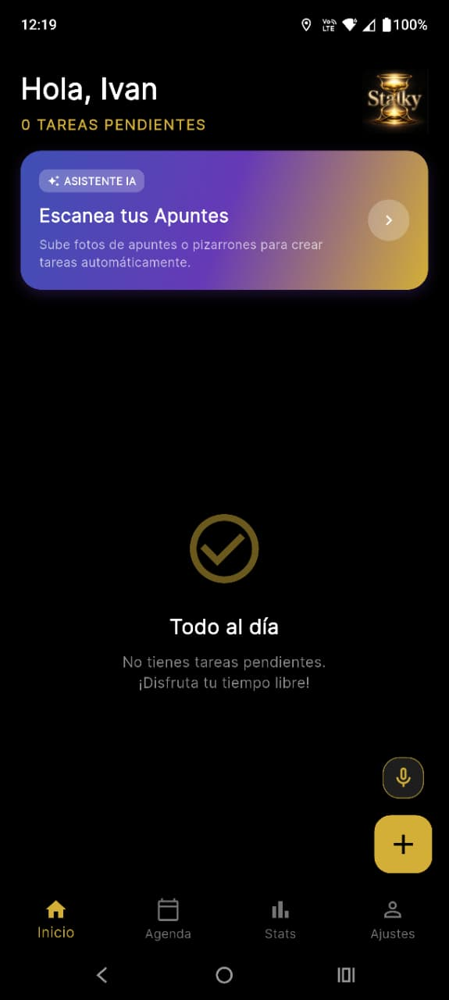
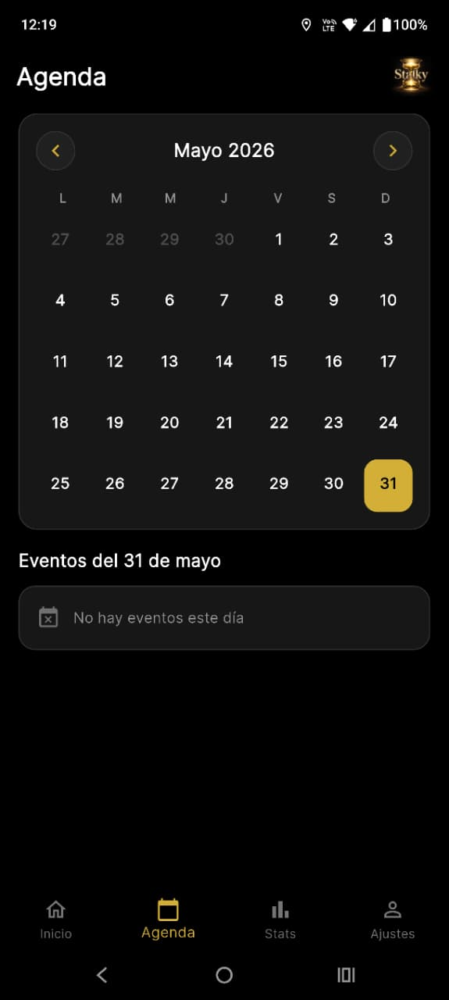
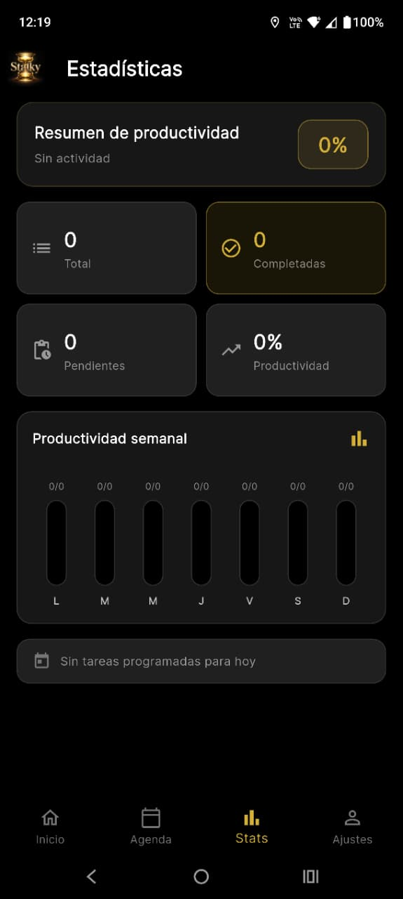

<!-- CABECERA -->
<div align="center">


[](https://github.com/jgl-homer/stalky/releases/latest)
[](https://flutter.dev)
[](https://firebase.google.com)
[](https://ai.google.dev)
[](LICENSE)
[]()

<p align="center">
  
  
  
</p>

</div>

---

Stalky es una app de recordatorios en Flutter enfocada en captura rápida de tareas, flujos de estudio asistidos por IA, dictado por voz y notificaciones programadas confiables.

La idea es simple: la app ayuda a detectar o capturar la tarea, pero el usuario decide cuándo quiere ser recordado.

## Tabla de Contenidos

- [Descripción general](#descripción-general)
- [Características](#características)
- [Flujo de la app](#flujo-de-la-app)
- [Stack tecnológico](#stack-tecnológico)
- [Arquitectura](#arquitectura)
- [Estructura del proyecto](#estructura-del-proyecto)
- [Configuración de Firebase](#configuración-de-firebase)
- [Google Sign-In](#google-sign-in)
- [Notificaciones](#notificaciones)
- [Asistente IA](#asistente-ia)
- [Dictado por voz](#dictado-por-voz)
- [Ejecutar localmente](#ejecutar-localmente)
- [Compilar APK](#compilar-apk)
- [Notas de seguridad](#notas-de-seguridad)
- [Roadmap](#roadmap)

## Descripción general

Stalky combina un gestor de tareas con herramientas de IA diseñadas para estudiantes y usuarios que necesitan recordatorios rápidos. El usuario puede crear un recordatorio manualmente, escanear una imagen con el asistente de estudio IA, o dictar un recordatorio por voz.

Las tareas detectadas se guardan en Firestore y se programan localmente en el dispositivo usando las APIs nativas de notificaciones.

## Características

- Inicio de sesión con correo/contraseña mediante Firebase Auth.
- Google Sign-In con Firebase Auth.
- Perfil de usuario y configuración de cuenta.
- Creación manual de tareas con fecha y hora.
- Detección de tareas con IA desde imágenes.
- Dictado por voz con análisis de IA.
- Almacenamiento de tareas en Firestore por usuario.
- Notificaciones locales programadas.
- Manejo de permisos de notificación en Android 13+.
- Manejo de permisos de alarma exacta en Android.
- Detección de zona horaria del dispositivo.
- Ícono personalizado del launcher.
- Interfaz oscura con acentos dorados.

## Flujo de la app

```text
El usuario inicia sesión
  |
  v
Dashboard
  |
  +-- Tarea manual
  |     +-- El usuario escribe título/detalles
  |     +-- El usuario selecciona fecha y hora
  |     +-- La app guarda la tarea
  |     +-- La app programa la notificación
  |
  +-- Asistente de estudio IA
  |     +-- El usuario sube una imagen
  |     +-- La IA detecta tareas
  |     +-- El usuario selecciona fecha/hora por tarea
  |     +-- La app guarda los recordatorios seleccionados
  |
  +-- Dictado por voz
        +-- El usuario dicta el recordatorio
        +-- La IA extrae tarea/fecha/hora
        +-- La app guarda y programa el recordatorio
```

## Stack tecnológico

- Flutter
- Dart
- Firebase Auth
- Cloud Firestore
- Firebase Messaging
- Firebase App Check
- Google Sign-In
- Gemini API con `google_generative_ai`
- `flutter_local_notifications`
- `speech_to_text`
- `flutter_timezone`
- `image_picker`
- `google_fonts`

## Arquitectura

La app está organizada en pantallas, servicios y widgets reutilizables.

- Las pantallas manejan la UI y la interacción del usuario.
- Los servicios manejan autenticación, análisis con IA, escritura en Firestore y programación de notificaciones.
- Los widgets proveen piezas de UI reutilizables como el botón de dictado por voz.
- Firebase almacena usuarios y tareas.
- Las notificaciones locales se programan en el dispositivo para que los recordatorios puedan dispararse incluso después de guardar la tarea.

## Estructura del proyecto

```text
.
├── android/
│   └── app/
│       ├── google-services.example.json
│       └── src/main/AndroidManifest.xml
│
├── assets/
│   ├── icon/
│   ├── logo/
│   └── sounds/
│
├── ios/
│   └── Runner/
│
├── lib/
│   ├── add_task_page.dart
│   ├── dashboard.dart
│   ├── edit_task_page.dart
│   ├── firebase_options.example.dart
│   ├── flashcards_page.dart
│   ├── gemini_assistant_page.dart
│   ├── login.dart
│   ├── main.dart
│   ├── profile.dart
│   ├── register.dart
│   │
│   ├── services/
│   │   ├── ai_service.dart
│   │   ├── auth_service.dart
│   │   ├── notification_service.dart
│   │   └── tools_registry.dart
│   │
│   └── widgets/
│       └── voice_dictation_button.dart
│
├── linux/
├── macos/
├── web/
├── windows/
├── pubspec.yaml
└── README.md
```

## Archivos importantes

| Archivo | Propósito |
| --- | --- |
| `lib/main.dart` | Bootstrap de la app, init de Firebase, zona horaria, init de notificaciones. |
| `lib/login.dart` | UI de login con correo/contraseña y Google. |
| `lib/dashboard.dart` | Dashboard principal de tareas y punto de entrada de recordatorios por voz. |
| `lib/add_task_page.dart` | Creación manual de recordatorios. |
| `lib/gemini_assistant_page.dart` | Análisis de imágenes con IA y confirmación de tareas detectadas. |
| `lib/profile.dart` | Perfil, cambio de contraseña, cierre de sesión y zona de peligro. |
| `lib/services/auth_service.dart` | Lógica de Firebase Auth y Google Sign-In. |
| `lib/services/ai_service.dart` | Detección de tareas con Gemini, análisis de voz, guardado en Firestore. |
| `lib/services/notification_service.dart` | Permisos de notificaciones locales y programación. |
| `lib/widgets/voice_dictation_button.dart` | Control reutilizable de dictado por voz. |

## Configuración de Firebase

Crea un proyecto en Firebase y habilita:

- Authentication
- Proveedor de correo/contraseña
- Proveedor de Google
- Cloud Firestore
- Firebase Messaging
- Firebase App Check, si se usa en tu entorno

Nombre del paquete Android:

```text
com.TaskingTech.android
```

Coloca el archivo de configuración de Firebase para Android aquí:

```text
android/app/google-services.json
```

Este archivo está intencionalmente ignorado por Git. Usa `android/app/google-services.example.json` solo como referencia de ejemplo.

Genera las opciones de Firebase para Flutter localmente:

```bash
dart pub global activate flutterfire_cli
flutterfire configure
```

Esto crea:

```text
lib/firebase_options.dart
```

Ese archivo también está ignorado por Git porque contiene claves de Firebase específicas del proyecto.

## Google Sign-In

Para Google Sign-In en Android, agrega las huellas SHA desde tu entorno de compilación local en la Configuración del Proyecto de Firebase.

Comando útil:

```bash
cd android
./gradlew signingReport
```

Después de agregar las huellas SHA-1/SHA-256 en Firebase:

1. Descarga un `google-services.json` nuevo.
2. Reemplaza `android/app/google-services.json`.
3. Recompila el APK.

## Notificaciones

Stalky usa `flutter_local_notifications` para programar recordatorios.

Manejo de notificaciones implementado:

- Solicitud de permiso de notificación en tiempo de ejecución en Android 13+.
- Solicitud de permiso de alarma exacta para Android moderno.
- Fallback a programación inexacta cuando las alarmas exactas están bloqueadas.
- Detección de zona horaria del dispositivo con `flutter_timezone`.
- Soporte de boot receiver mediante entradas en el manifest de Android.

Prueba recomendada en dispositivo real:

1. Instala el APK en un dispositivo Android.
2. Permite las notificaciones.
3. Crea una tarea 2 o 3 minutos en el futuro.
4. Cierra la app.
5. Confirma que la notificación se dispara.

## Asistente IA

El asistente de estudio IA está diseñado para imágenes de apuntes, pizarrones o material escolar.

Flujo:

1. El usuario sube una imagen.
2. Gemini analiza el contenido.
3. Las tareas detectadas se muestran como tarjetas.
4. El usuario selecciona fecha y hora.
5. El usuario guarda el recordatorio manualmente.

Esto evita que se guarden tareas sin fecha de recordatorio.

## Dictado por voz

El dictado por voz usa speech-to-text más análisis con IA.

Ejemplo:

```text
Recuérdame entregar la tarea de matemáticas mañana a las 6 pm
```

La IA extrae:

- Título de la tarea
- Categoría
- Notas
- Fecha y hora de vencimiento

Si el dictado no incluye una fecha y hora claras, la app muestra un error en lugar de guardar un recordatorio incompleto.

## Ejecutar localmente

Instala dependencias:

```bash
flutter pub get
```

Ejecuta en un dispositivo conectado o emulador:

```bash
flutter run
```

Analiza el código:

```bash
flutter analyze
```

Formatea el código:

```bash
dart format .
```

## Compilar APK

Compila el APK de release:

```bash
flutter build apk
```

Salida:

```text
build/app/outputs/flutter-apk/app-release.apk
```

## Notas de seguridad

Antes de hacer este repositorio público, revisa:

- Claves de API
- Configuración de Firebase
- Configuración de App Check
- Reglas de Firestore
- Archivos de firma de Android
- Cualquier archivo de entorno local

No subas keystores de producción, cuentas de servicio privadas, claves de API sin restricciones, `google-services.json`, ni opciones de Firebase generadas.

Archivos solo locales ignorados por Git:

```text
.env
android/app/google-services.json
ios/Runner/GoogleService-Info.plist
lib/firebase_options.dart
public/
```

## Roadmap

- Pantalla mejorada para pruebas de recordatorios.
- Historial de notificaciones.
- Filtros y búsqueda de tareas.
- Mejor sincronización offline.
- Más controles de análisis con IA.
- Onboarding más limpio para nuevos usuarios.
- Mejoras de notificaciones en iOS.

## Estado

En desarrollo activo. El enfoque actual es la confiabilidad, UX limpia y hacer que la creación de recordatorios se sienta rápida.
